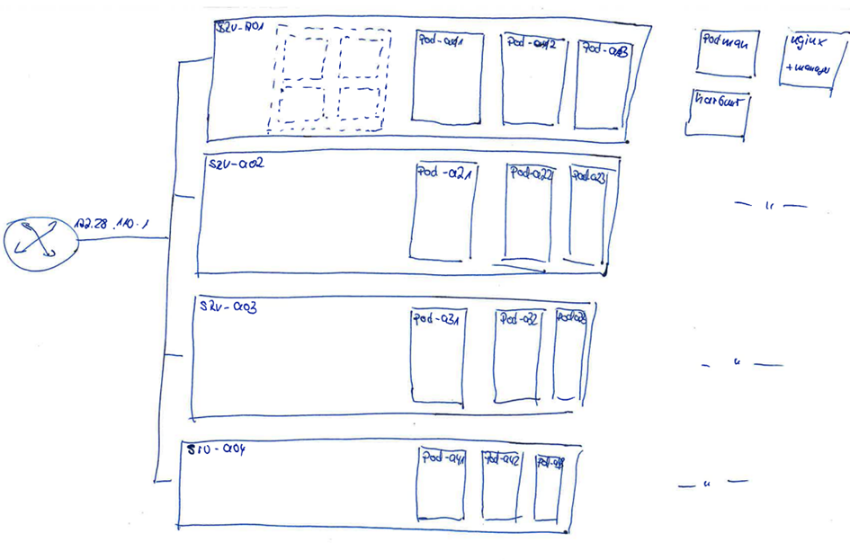

# Aufgabenstellung:

## Hardware / Operating System

> Es soll ein kleines Datacenter aufgebaut werden. Als Basishardware stehen je 1 HL DL 165 g7 für jede Gruppe zur Verfügung. Die Hardware hat 300GB Festplatte und 96GB RAM mit 2x 8-Kernen Opterons.
>
> Die Server sind it QEmu und Cockpit ausgerüstet und sind derzeit wie folgt erreichbar:

-   SRV-a01: 192.168.30.80:9091 Login: team01 / labor123

-   SRV-a02: 192.168.30.80:9092 Login: team02 / labor123

-   SRV-a03: 192.168.30.80:9093 Login: team03 / labor123

-   SRV-a04: 192.168.30.80:9094 Login: team04 / labor123

Intern befinden sich die Server im Netz 172.28.110.0/24 mit den IPs 110, 120, …

> Das installierte Betriebssystem ist derzeit Debian 12 (Bookworm), mit Cockpit (incl. Cockpit-maschines) und qemu.

## Zielsystem:

> Das nachfolgende Bild zeigt den prinzipiellen Aufbau der Basis, mit allen 4 Servern.
>
> 

# TEAM AUFGABE 1

Es sind 3 Virtuelle Maschinen (QEMU) zu installieren. Jede der Maschinen soll (mindestens) die folgende Hardware aufweisen:

-   Remote Management Software

-   Netzwerk konfiguration

# TEAM Aufgabe 2

Auf den Virtuellen Maschinen **pod-a_1**, **pod-a_2**, **pod-a_3** wird kubernetes installiert. ( An Stelle von \_ ist jeweils die Nummer des Teams e.g. 1, 2, 3, 4 einzusetzen):

-   docker-ce (Community Version von Docker, nicht Debian)

-   Installieren *Kubelet*, *Kube-ctl*, *Kube-admin*

Eine Beschreibung wie *kubernetes* installiert und konfiguriert wird, befindet sich auf [*Kubernetes Installation*](https://www.cherryservers.com/blog/install-kubernetes-ubuntu).

# TEAM Aufgabe 3

Auf dem Basisserver (srv-a01, srv-a02. srv-0a3, srv-a04) sollen die folgenden Dienste bereitgestellt werden:

-   PODMAN (Container Management)

-   HARBOR (Container Registry)

-   NGINX (mit Manager-Software)

Diese Software Komponenten können als VMs (QEMU) oder Container bereitgestellt werden. TIP: Es gibt ein Plugin für Portainer und Cockpit.

# Durchführung

### Software / VMs:

> Es sind 3 Linux VMs zu installieren, jeweils mit Docker installiert. Jede dieser VMs soll als Kubernetes Node laufen.

### Software

An dieser Stelle sollen jedes Team entscheiden, ob die Software mit Docker/Podman oder QEmu installiert wird.

Zur Steuerung des Systems sind die folgenden Maschinen vorgesehen:

-   PORTAINER: Steuerung der Containervirtualisierung (max. 3 Hosts)

-   OPEN NEBULA: Management heterogener Infrastrukturen

-   NGINX: Reverseproxy mit Management Modul (zu Cont. Und VMs)

-   HARBOR: Container Repository

> Je nach Ablauf kann auch ein Kubernetes Dashboard erstellt werden, mit dem die Kubernetes Nodes bezüglich ihrer Performance überwacht werden können.

# QEMU

QEMU ist bereits installiert, die Konfiguration und Netzwerkeinrichtung wird durch die Teams vorgenommen.

# Kubernetes PODS

Als Basis soll jeweils eine virtuelle Linux-Maschine zum Einsatz kommen. Diese muss vor der eigentlichen Kubernetes Installation bereits eingerichtet sein. Die Namen der Pods sind pod-aX1, pod-aX2, pod-aX3, wobei X (1,2,3,4) für das Team steht.

# Kubernetes Installation:

<https://www.cherryservers.com/blog/install-kubernetes-ubuntu>

<https://www.plural.sh/blog/install-kubernetes-ubuntu-tutorial/>

# NGINX-Reverseproxy (mit Absicherung)

<https://www.plural.sh/blog/install-kubernetes-ubuntu-tutorial/>

<https://www.ionos.at/digitalguide/server/konfiguration/nginx-reverse-proxy/>

<https://docs.nginx.com/nginx/admin-guide/web-server/reverse-proxy/>

# NGINX-Proxymanager

<https://nginxproxymanager.com/>

# PORTAINER installieren

<https://www.howtoforge.de/anleitung/wie-installiere-ich-portainer-unter-debian-11/>

<https://docs.portainer.io/start/install-ce>

# Open Nebula

<https://docs.opennebula.io/6.8/installation_and_configuration/frontend_installation/install.html>

<https://computingforgeeks.com/install-opennebula-kvm-node-on-debian/>

<https://www.atlantic.net/vps-hosting/how-to-install-opennebula-on-debian/>

# TEAM Bildung

## TEAM 01

|            |     |     |     |     |     |     |
|------------|-----|-----|-----|-----|-----|-----|
| Aufgabe 1: |     |     |     |     |     |     |
| Aufgabe 2: |     |     |     |     |     |     |
| Aufgabe 3: |     |     |     |     |     |     |

## TEAM 02

|            |     |     |     |     |     |     |
|------------|-----|-----|-----|-----|-----|-----|
| Aufgabe 1: |     |     |     |     |     |     |
| Aufgabe 2: |     |     |     |     |     |     |
| Aufgabe 3: |     |     |     |     |     |     |

## TEAM 03

|            |     |     |     |     |     |     |
|------------|-----|-----|-----|-----|-----|-----|
| Aufgabe 1: |     |     |     |     |     |     |
| Aufgabe 2: |     |     |     |     |     |     |
| Aufgabe 3: |     |     |     |     |     |     |

## TEAM 04

|            |     |     |     |     |     |     |
|------------|-----|-----|-----|-----|-----|-----|
| Aufgabe 1: |     |     |     |     |     |     |
| Aufgabe 2: |     |     |     |     |     |     |
| Aufgabe 3: |     |     |     |     |     |     |
